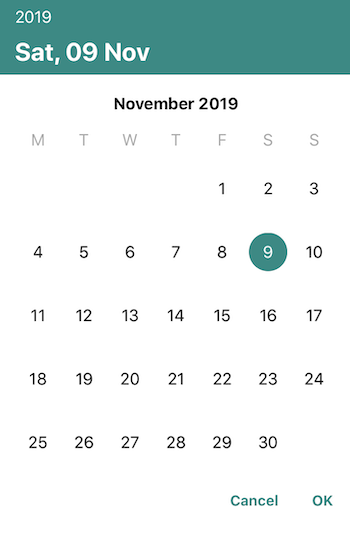

## Preview



## Installation

To integrate DGDatePicker into your Xcode project using CocoaPods, specify it in your `Podfile`:

```ruby
# 1. Add the remote repos
source 'https://github.com/CocoaPods/Specs.git'
source 'https://github.com/dgrgiou/DGPrivatePodSpecs.git'

platform :ios, '11.0'
use_frameworks!

target '<Your Target Name>' do
    # 2. Add pod 
    pod 'DGDatePicker'
end
```

Then, run the following command:

```bash
$ pod install
```

## Usage

```swift
// 1. Import module
import DGDatePicker

// 2. Add CalendarProtocol
class ViewController: UIViewController, CalendarProtocol {

    override func viewDidLoad() {
        super.viewDidLoad()
        // Do any additional setup after loading the view, typically from a nib.
    }
    
    .
    .
    .
    
    // 3. Conform to required method
    func calendarDidClosed(selectedDate: Date) {
        // The callback from the selected date
    }
    
    // 4. Show modal calendar simple like this
    func showCalendar() {
        let calendarVC = CalendarVC()
        calendarVC.modalPresentationStyle = .overCurrentContext
        calendarVC.calendarDelegate = self
        present(calendarVC, animated: true, completion: nil)
    }
}
```
